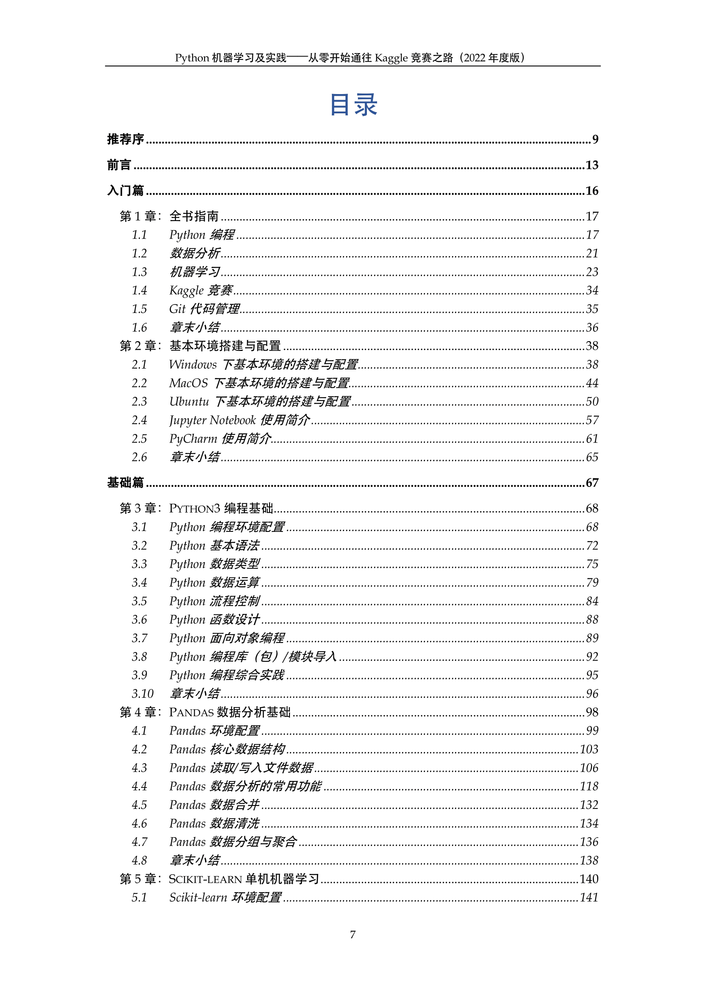
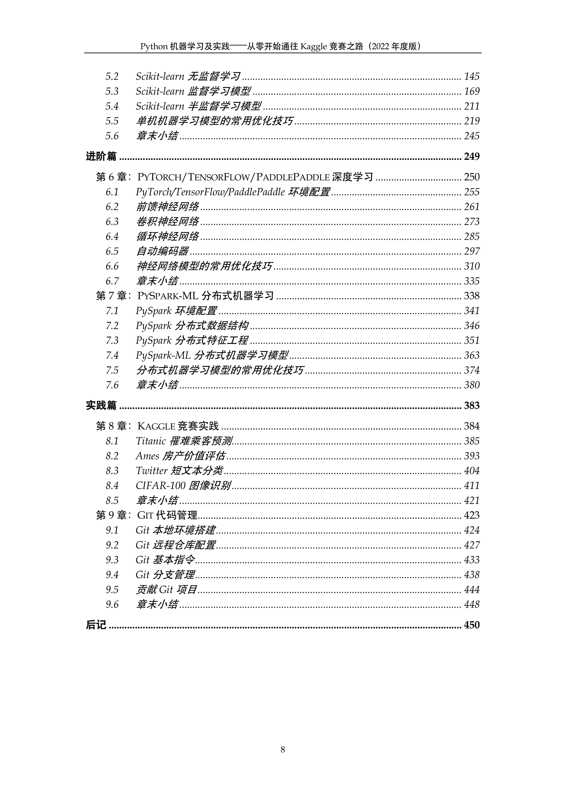

## 《Python机器学习及实践：从零开始通往Kaggle竞赛之路（2022年度版）》

### 1. 全书概要

《Python机器学习及实践：从零开始通往Kaggle竞赛之路（2022年度版）》一书适合所有对人工智能（Artificial Intelligence）领域，特别是机器学习（Machine Learning）、数据挖掘（Data Mining），以及自然语言处理（Natural Language Processing）等技术与实践感兴趣的初学者。

本书以Python 3.x编程语言为基础，在不赘述大量数学模型与复杂编程知识的前提下，从零开始带领广大读者，逐步熟悉并且掌握当下最流行的基于Python的数据分析，以及支持单机、深度和分布式机器学习的开源程序库。这些热门的Python程序库包括：Pandas、Scikit-learn、PyTorch、TensorFlow、PaddlePaddle、PySpark-ML等。

全书所介绍的上述核心工具，均是作者本人长期总结行业经验和精心筛选的成果。在面对现实中的工程或者科研问题，甚至是参加一些公开的竞赛（如：Kaggle、天池竞赛，等等）的时候；相信本书都能够帮助读者使用Python编程语言快速上手，并结合一系列经典的开源工具，搭建行之有效的计算机程序来解决实际问题。

在大数据时代，只要是与数据相关的从业人员，掌握Python编程、数据分析、乃至机器学习的能力，都是一个不错的职业加分项。不论是在金融、统计、数理研究、物理计算、社会科学、工业工程等领域的从业者；还是在互联网行业的程序员、数据分析师、运营人员、产品经理等，都会对本书有着不同程度的学习需求。

本书所介绍的知识，相信一定能够帮助读者通过一些专业类的考试，如：人工智能工程师认证、注册数据分析师认证（CDA、CPDA），等等；或者，增加自身的行业竞争力、提高工作效率、并且拓展对数据的认识。同时，鉴于内容的入门性和普适性，本书也可以被广泛用于：初、高中生的信息学兴趣培训，专科职业教育，本科、研究生通识课程的讲授，等等。

全书共包括四大核心篇章，分别是：
- 入门篇：包括对全书核心概念的指南性介绍，以及在多种主流操作系统（Windows、MacOS，以及Ubuntu）上如何配置基本编程环境的详细说明。
- 基础篇：涵盖了Python3的编程基础、基于Pandas的数据分析，以及使用Scikit-learn解决大量经典的单机（单核/多核）机器学习问题。
- 进阶篇：介绍如何使用PyTorch、TensorFlow，以及PaddlePaddle分别各自搭建多种深度学习网络框架，甚至是基于PySpark的ML程序库完成一些常见的分布式机器学习任务。
- 实践篇：利用全书所讲授的Python编程、数据分析，以及机器学习知识，从事Kaggle多种类型的竞赛实战。同时，介绍如何使用Git在Gitee与Github平台上维护和管理日常代码与编程项目。

全书基于Python3的实践代码和数据均已分别开源在Gitee和Github平台：
- 推荐中国大陆地区的读者，根据如下链接从Gitee平台下载： https://gitee.com/godfanmiao/ML-Kaggle-Gitee-2022
- 建议港、澳、台，及海外地区的读者，根据如下链接从Github平台下载：https://github.com/godfanmiao/ML-Kaggle-Github-2022 

### 2. 作者介绍

范淼 
[(电子邮箱)](mailto:fanmiao.cslt.thu@gmail.com)[(新浪微博)](https://www.weibo.com/u/2687929943)：
- 2008年，就读于北京邮电大学软件学院，软件工程专业。
- 2012年，保送至清华大学计算机系，攻读工学博士学位；研究方向涉及机器学习理论与应用技术。
- 2015年，受国家留学基金委公派，赴美国纽约大学计算机系联合培养。
- 2017年，获得清华大学计算机科学与技术工学博士学位。
- 2019年，百度-清华大学软件学院联合培养博士后出站。

### 3. 书籍目录

### 4. 购书链接

- 京东：
- 当当：
- 亚马逊：

### 5. 勘误列表

#### 代码勘误
- 请参考本书第9章，统一使用Git工具，pull request到bug-fix分支。
- 正式代码发布在master分支。

#### 书籍勘误
- X页X行，原文“XX”；修改为“XX”。

